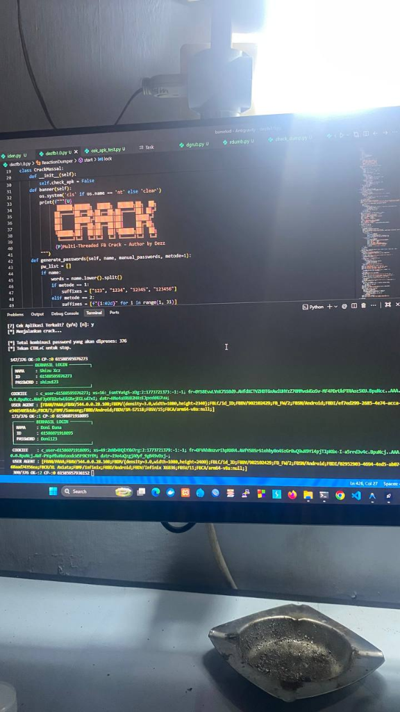
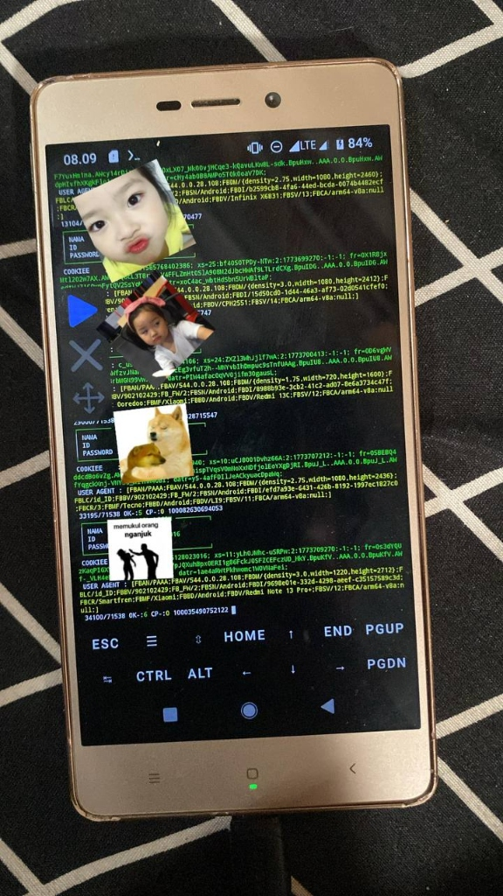

```text
 ██████╗ ██████╗  █████╗  ██████╗ ██╗  ██╗ 
██╔════╝ ██╔══██╗██╔══██╗██╔════╝ ██║ ██╔╝ 
██║      ██████╔╝███████║██║      █████╔╝  
██║      ██╔══██╗██╔══██║██║      ██╔═██╗  
╚██████╗ ██║  ██║██║  ██║╚██████╗ ██║  ██╗ 
 ╚═════╝ ╚═╝  ╚═╝╚═╝  ╚═╝ ╚═════╝ ╚═╝  ╚═╝ 
        Multi-Threaded FB Crack - Author by Dezz
```

# DEZ-FB v1.0 - Multi-Threaded FB Crack - Author by Dezz

Alat integrasi canggih untuk dumping dan cracking Facebook menggunakan **API Internal Berlapis** dan **Sistem Enkripsi Khusus**. Dirancang untuk performa tinggi dengan fitur auto-chaining yang tak terbatas untuk hasil maksimal.

### 🌟 Fitur Utama
*   **Unlimited Friend Dumper**: Dump daftar teman secara rekursif (berantai) secara otomatis tanpa henti.
*   **High Performance Dumper**: Dump anggota grup dan reaksi postingan dengan kecepatan tinggi menggunakan jalur akses data internal.
*   **Advanced Crack Engine**: Mendukung login dengan sistem enkripsi khusus yang meniru perilaku aplikasi resmi untuk keamanan maksimal.
*   **Multi-Threading Target**: Pemrosesan target secara paralel yang dapat disesuaikan (Custom Threads).
*   **Smart Progress Indicator**: Indikator progres yang akurat berbasis jumlah akun unik (bukan sekadar jumlah password).
*   **Dump Management**: Opsi fleksibel setelah dump selesai—pilih untuk langsung melakukan crack, simpan ke file dengan nama kustom, atau hapus/batal.
*   **Automatic Password Generator**: Membuat daftar sandi otomatis berbasis nama target (First Name/Full Name) ditambah suffix cerdas atau custom.

### 🚀 Cara Instalasi & Menjalankan
Pastikan Anda sudah menginstal Python kemudian jalankan perintah berikut:

```bash
# Clone repository ini (jika sudah di GitHub)
git clone https://github.com/dzDev3/DEZ-FB.git
cd DEZ-FB

# Instal dependensi
pip install requests

# Jalankan tools
python fbcrack.py
```

### 📋 Catatan Penting
- Memerlukan **Cookie Facebook** yang valid saat awal dijalankan.
- Mendukung pemprosesan hingga **100.000+ ID** tanpa lag (tergantung RAM & Koneksi).
- Hasil login sukses (OK) dan terjepit (CP) otomatis tersimpan di folder `Results/`.

### 💡 Tips & Strategi Crack
- **Koneksi WiFi**: Mendukung brute-force via WiFi (hasil tergantung faktor keberuntungan/hoki).
- **Mode Pesawat (Direkomendasikan)**: Untuk hasil yang lebih maksimal dan menghindari IP spam, disarankan menggunakan **Mode Pesawat** dengan bantuan **Auto Clicker**.
- **Setting Auto Clicker**: Atur jeda sekitar **10 detik** (aktifkan mode pesawat) dan setiap **2 menit** (matikan/siklus) untuk mengganti Alamat IP secara berkala.

### 📸 Tampilan / Screenshots
Berikut adalah visualisasi antarmuka aplikasi saat dijalankan:

| Tampilan Terminal PC | Tampilan Termux (Mobile) |
| :---: | :---: |
|  |  |

---
**Author: dzDev3 (DEZ-FB Development)**  
*Project ini dibuat untuk tujuan pembelajaran dan riset keamanan digital.*
